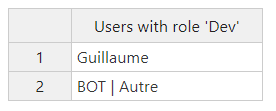

# Discord BOT :

This BOT allows you to export a list of users who has a specific role in a .csv file.

To use the BOT, you just need to wrote a command and specify which role you want. For exemple : 

```js
!users_list Admin
```

#### Once you typed this command, you get a confirmation message in the  discord chat.


#### The bot also generate a .csv file named "export_data.csv". You can open this file online using this [Link](https://limonte.github.io/csv-viewer-online/).

